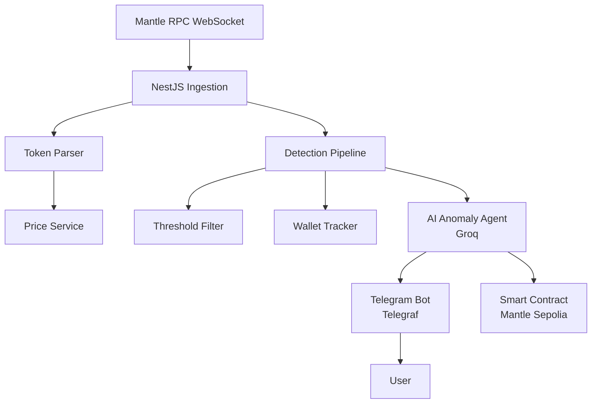

# ManSpy

**AI-powered whale alerts for Mantle Network, delivered to Telegram.**

Live bot: [@ManSpyAIBot](https://t.me/ManSpyAIBot)  
Deployed service: [https://manspy.onrender.com](https://manspy.onrender.com)  
Hackathon: Mantle Turing Test 2026 — AI Alpha & Data Track

---

## Overview

ManSpy monitors Mantle Network in real time via WebSocket, detects whale movements and on-chain anomalies, and delivers plain-English alerts to Telegram. Users configure their own rules — thresholds, tracked wallets — and an AI agent watches the chain for them.

The human sets the rules. The AI watches the chain.

---

## The Problem

On-chain activity on Mantle moves fast. Whale wallets execute large transfers, smart money rotates positions, and anomalies appear and disappear within minutes. Retail traders either miss these signals entirely or spend hours manually checking block explorers.

No accessible, real-time, AI-powered alert system exists specifically for Mantle that brings these signals directly to where crypto-native users already are — Telegram.

---

## The Solution

**Real-time monitoring.** ManSpy listens to Mantle's block stream via WebSocket (not polling), achieving sub-10-second latency from block confirmation to alert delivery.

**Dual detection.** Every transaction is checked against two criteria: the user's configured USD threshold, and any wallets they have registered for tracking.

**AI-powered intelligence.** Flagged transactions are analyzed by Groq (llama-3.3-70b-versatile), which identifies patterns (CEX withdrawals, batch transfers, dormant wallet activation, whale distribution), names known entities (Bybit Hot Wallet, Agni Finance), and assesses risk. Unknown addresses are enriched with Nansen profiler data (holdings, PnL, activity) for deeper context. AI analysis appends instantly — under 2 seconds.

**Aggregated flow signals.** Beyond per-transaction alerts, ManSpy aggregates the rolling transaction stream into market-wide signals — net CEX flow (withdrawals vs. deposits), top accumulating wallets, and distribution waves — surfaced on demand via `/flows`. The same flow context feeds the AI prompt, so summaries lead with the aggregate ("3rd Bybit outflow in 30m, $X cumulative") instead of restating a single transfer.

**Verifiable on-chain audit.** Every AI verdict is logged to the `ManSpyAlertLog` contract on Mantle Sepolia. The `/contract` command surfaces the verified contract and a live count of verdicts logged — a tamper-proof, auditable track record for the agent.

**User control.** All configuration is self-serve via Telegram commands (registered with Telegram's command menu, so they appear in the `/` autocomplete):
- `/watch <address> <label>` — track a specific wallet
- `/unwatch <address>` — stop tracking a wallet
- `/list` — show tracked wallets
- `/threshold <usd>` — set minimum alert value
- `/alerts on|off` — toggle notifications
- `/analyse <address>` — on-demand AI profile of any wallet (Nansen holdings, PnL, behaviour)
- `/flows` — live market flow digest (net CEX flow, top accumulators, distribution waves)
- `/contract` — on-chain audit trail (contract + live verdict count)
- `/status` — view current settings and rate limit usage

---

## Demo Video

📺 **[Watch the demo on YouTube](https://www.youtube.com/watch?v=H-8h9S1-lwA)**

The video demonstrates: real-time alert firing, instant AI analysis with Nansen enrichment, wallet tracking configuration, rapid alert handling, and production infrastructure.

---

## Architecture



**Data flow:**
1. `MantleListenerService` receives blocks via WebSocket from `wss://wss.mantle.xyz`
2. `TransactionNormalizerService` extracts transaction data
3. `TokenParserService` parses ERC-20 Transfer events from receipts
4. `PriceService` converts token amounts to USD (CoinGecko primary, Bybit fallback)
5. `DetectionService` matches transactions against user thresholds and tracked wallets
6. `AnomalyService` enriches unknown addresses via Nansen profiler trio, then sends to Groq for instant pattern analysis
7. `AlertLogService` logs the AI result on-chain via `ManSpyAlertLog` smart contract
8. `TelegrafService` delivers alerts to Telegram with inline action buttons

---

## Mantle Integration

- **RPC endpoint:** `wss://wss.mantle.xyz` (WebSocket for real-time block streaming)
- **Explorer links:** Every alert includes a link to `mantlescan.xyz` for transaction verification
- **Native token pricing:** MNT/USD via CoinGecko API with 60-second Redis caching
- **Token parsing:** Dynamic token list from `token-list.mantle.xyz` with 40-token fallback for ERC-20 identification
- **Smart contract:** Alert records logged on-chain for permanent auditability

---

## Smart Contract

**Network:** Mantle Sepolia Testnet  
**Address:** `0xBefF514A396A4c500d6C15fEF536875Ff9f22711`  
**Explorer:** [Verified on MantleScan](https://sepolia.mantlescan.xyz/address/0xBefF514A396A4c500d6C15fEF536875Ff9f22711)

The `ManSpyAlertLog` contract permanently records every AI anomaly analysis on Mantle:
- `logAlert(txHash, pattern, riskLevel, confidence)` — callable by the AI agent after each analysis
- `records(id)` — public view function to query any historical alert
- `getRecordCount()` — total number of logged alerts

**Verified transaction:** [`0x69bbeb...01e844`](https://sepolia.mantlescan.xyz/tx/0x69bbeb627ec155819328266bb563f9dd6c3e777214305bfa7c65931daf01e844) — first on-chain alert logged (pattern: `cex_withdrawal`, confidence: 95%).

Every AI decision is now auditable on-chain, creating a verifiable track record for the agent.

---

## Features

| Feature | Description |
|---|---|
| Real-time whale detection | Monitors all Mantle blocks, alerts on transactions above user threshold |
| Wallet tracking | Register any address with a custom label, monitor all its transactions |
| AI anomaly analysis | Groq-powered instant pattern detection with Nansen enrichment and risk assessment |
| On-demand wallet analysis | `/analyse <address>` returns an AI wallet profile — entity label, Nansen holdings/PnL, recent flow, pattern + risk verdict |
| Aggregated flow signals | `/flows` digest: net CEX flow, top accumulators, distribution waves; same context enriches every AI summary |
| On-chain audit trail | `/contract` surfaces the verified Mantle Sepolia contract and a live count of AI verdicts logged |
| Nansen enrichment | Unknown addresses enriched with holdings, PnL, and transaction history |
| Rate limiting | 10 alerts per hour per user, with status visibility |
| Production reliability | Health checks, graceful shutdown, automatic crash recovery, exponential backoff reconnection |

---

## Testing the Live Bot

The deployed service includes test endpoints for verification:

```bash
# Trigger a test alert to your Telegram chat
curl -X POST https://manspy.onrender.com/test/alert \
  -H "Content-Type: application/json" \
  -d '{"chatId": YOUR_CHAT_ID, "usdValue": 7500}'

# View recent anomaly analysis results
curl https://manspy.onrender.com/test/last-anomaly

# Seed a demo flow scenario (CEX outflow + distribution wave + accumulator),
# then send /flows in Telegram to see the digest light up
curl -X POST https://manspy.onrender.com/test/seed-flows \
  -H "Content-Type: application/json" -d '{}'
```

Health check:
```bash
curl https://manspy.onrender.com/health
# → {"ok": true}
```

---

## Local Setup

**Prerequisites:** Node.js 20+, PostgreSQL 16, Redis 7

```bash
# Clone and install
git clone https://github.com/major101x/manspy.git
cd manspy
npm install

# Configure environment
cp .env.example .env
# Edit .env with your TELEGRAM_BOT_TOKEN, GROQ_API_KEY, DATABASE_URL, REDIS_URL

# Database setup
npx prisma migrate dev
npx prisma generate

# Start services
docker compose up -d  # PostgreSQL + Redis
npm run start:dev
```

**Required environment variables:**
- `TELEGRAM_BOT_TOKEN` — from [@BotFather](https://t.me/botfather)
- `GROQ_API_KEY` — from [Groq Console](https://console.groq.com)
- `NANSEN_API_KEY` — from [Nansen](https://nansen.ai) (optional, for wallet enrichment)
- `DATABASE_URL` — PostgreSQL connection string
- `REDIS_URL` — Redis connection string (optional, for price caching)
- `PORT` — HTTP server port (default 3000)
- `PRIVATE_KEY` — Deployer wallet for on-chain logging (with Mantle Sepolia ETH)
- `CONTRACT_ADDRESS` — `0xBefF514A396A4c500d6C15fEF536875Ff9f22711`

---

## Business Model

Freemium tiers with clear upgrade paths:

| Tier | Price | Included |
|---|---|---|
| **Free** | $0 | 10 alerts/hour, basic AI analysis, wallet tracking |
| **Pro** | $12/mo | Unlimited alerts, instant AI analysis, custom thresholds, Nansen wallet profiling |
| **Enterprise** | $99/mo | API access, custom single-wallet analysis, Nansen Smart Money labels + premium entity tags, dedicated support |

**Growth path:** Mantle → Multi-chain (Ethereum, Arbitrum) → Web dashboard → White-label API for exchanges.

---

## Tech Stack

| Layer | Technology |
|---|---|
| Backend | NestJS 11, TypeScript 5 |
| Telegram Bot | Telegraf 4 |
| Blockchain | viem, Mantle RPC (WebSocket) |
| AI | Groq API (llama-3.3-70b-versatile) |
| Database | PostgreSQL 16 + Prisma 6 |
| Enrichment | Nansen API (profiler trio) |
| Cache | Redis 7 (optional, for price + Nansen data) |
| Price Data | CoinGecko API + Bybit fallback |
| Deployment | Render (free tier) |

---

## Project Structure

```
src/
├── bot/                    # Telegram command handlers
├── common/
│   ├── chain-intel/        # Address labels + tx buffer + flow aggregator
│   └── prisma/             # Database client
├── config/                 # Environment configuration
├── detection/              # Threshold + wallet matching + rate limiting
├── anomaly/                # Groq AI analysis + Nansen enrichment
├── ingestion/              # Mantle WebSocket listener + token parsing
├── price/                  # MNT/USD price service
├── nansen/                 # Nansen profiler trio integration
├── web3/                   # On-chain alert logging (Mantle Sepolia)
├── test/                   # E2E test endpoints
├── app.module.ts
└── main.ts

contracts/
├── ManSpyAlertLog.sol      # Solidity alert logging contract
└── ManSpyAlertLog.json     # Compiled ABI + bytecode

scripts/
├── compile.ts              # Compile contract with solc
└── deploy.ts               # Deploy to Mantle Sepolia
```

---

## License

MIT
